### Phân biệt Multi-Class Classification và Multi-Label Classification:

1. Multi-Class Classification:
    - Định nghĩa: Mỗi mẫu dữ liệu (input) chỉ thuộc một lớp duy nhất trong số nhiều lớp có thể có.
    - Ví dụ: Nhận dạng loài vật trong ảnh: ["Chó", "Mèo", "Vịt"] → Ảnh chỉ có thể là một trong các loài này.
    - Số lượng nhãn: Một nhãn duy nhất cho mỗi mẫu.
    - Ký hiệu đầu ra: Một giá trị duy nhất từ tập hợp lớp, ví dụ: y = 0, y = 1, y = 2.
    - Hàm kích hoạt: Softmax.
    - Loss function phổ biến: Categorical Cross-Entropy.
1. Multi-Label Classification:
    - Định nghĩa: Mỗi mẫu dữ liệu có thể thuộc về nhiều lớp cùng lúc.
    - Ví dụ: Phân loại chủ đề bài báo: Một bài viết có thể cùng lúc thuộc "Thể thao", "Chính trị", "Giải trí".
    - Số lượng nhãn: Một hoặc nhiều nhãn cho mỗi mẫu.
    - Ký hiệu đầu ra: Vector nhị phân, ví dụ: [1, 0, 1, 0] (có nhãn 1 và 3).
    - Hàm kích hoạt: Sigmoid (cho từng nhãn).
    - Loss function phổ biến: Binary Cross-Entropy.

Ta muốn biết nên sử dụng NLP nào thì hãy xét theo mẫu với điều kiện "Một mẫu có thể thuộc nhiều lớp không":
    - Nếu không -> dùng multi-class.
    - Nếu có -> dùng multi-label

### Multi-Label Classification:

Như đã phân biệt ở trên, Multi-Label Classification là từ một mẫu dữ liệu ta có thể phân về nhiều lớp cùng lúc
=> Chính vì vậy ta sử dụng hàm kích hoạt Sigmoid: 
$$
\sigma(x) = \frac{1}{1 + e^{-x}}
$$


Trong đó i là số nhãn có thể trong mẫu dữ liệu.
Công thức trên chuyển đầu xi thành một giá trị xác suất trong khoảng (0,1) để biểu diễn khả năng có mặt của nhãn i. Nhờ vậy ta có
thể phân loại một ảnh/văn bản có thể nhiều nhãn đúng.

Kết luận: hàm kích hoạt sigmoid đưa bài toán phân loại đa nhãn thành một bài toán phân loại n nhị phân.

### Bài toán phân loại thể loại phim ảnh:

1. Tải và xử lí dữ liệu (thư viện pandas): 
    - ```df = pd.read.csv_(file_path)```: đọc file CSV thành 1 dataframe df.
    - ```df.isnull().sum()```: Kiểm tra dữ liệu có bị thiếu hay không.
    - ```df.dropna(subset = ['description', 'gernes', 'rating'])``` : loại bỏ các hàng bị thiếu dữ liệu.
    - ```df['genres_list'] = df['genres'].apply(lambda x: [genre.strip() for genre in x.split(',')])``` : tách cột genre thành list các genres (ex: ["action", "comedy"]).
    - ```df = df.drop_duplicates(subset=['title', 'description'])```: Bỏ qua các phim trùng tiêu đề và description để tránh xét thêm các phần phim khác của phim đã có sẵn.
2. Bóc tách (explode) danh sách thể loại:
    - ```gerne_df = df.explode('genres_list')```: Tách các thể loại trong danh sách thành một dòng riêng biệt.
    - ``` genre_counts = genre_df['genres_list'].value_counts().reset_index() genre_counts.columns = ['genre', 'count']``` : với ```value_counts()``` đếm số lần xuất hiện mỗi genre và ```reset_index()``` 
  biến kết quả thành data frame.
    - Trực quan dữ liệu thể loại:  
    ``` # Create barplot
    plt.figure(figsize=(12, 8))
    ax = sns.barplot(x='count', y='genre', data=top_genres, palette='viridis')

    # Add count labels to the bars
    for i, count in enumerate(top_genres['count']):
        ax.text(count + 5, i, str(count), va='center')

    plt.title('Top 20 Most Common Movie Genres', fontsize=16)
    plt.xlabel('Count', fontsize=12)
    plt.ylabel('Genre', fontsize=12)
    plt.tight_layout()
    plt.show()  # Hiển thị bar chart

    # Create a pie chart for top 10 genres
    plt.figure(figsize=(10, 10))
    top10 = genre_counts.head(10)
    plt.pie(top10['count'], labels=top10['genre'], autopct='%1.1f%%',
            shadow=True, startangle=90, colors=plt.cm.Paired(np.linspace(0, 1, 10)))
    plt.axis('equal')
    plt.title('Distribution of Top 10 Movie Genres', fontsize=16)
    plt.tight_layout()
    plt.show()  # Hiển thị pie chart
    ```

    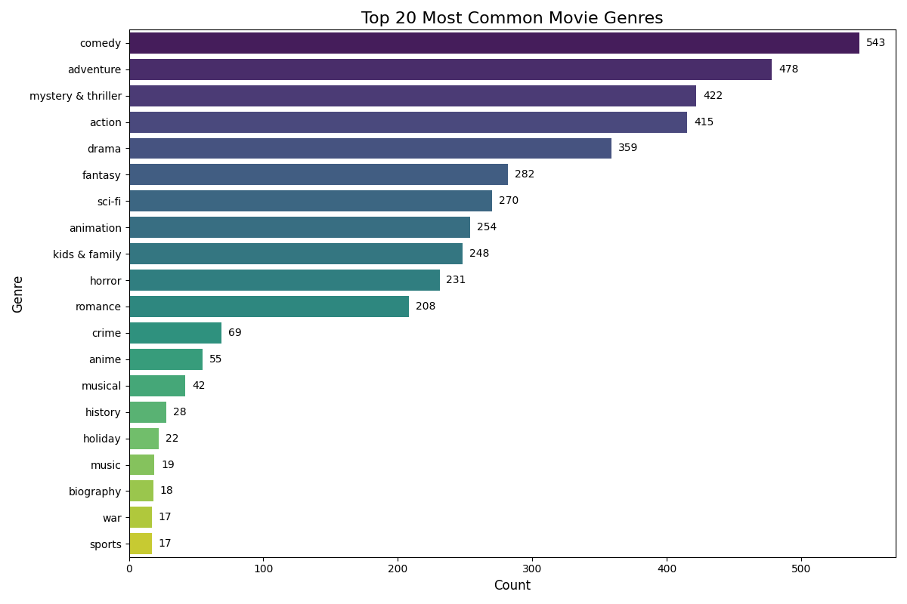
    <p><em>Biểu đồ cột thể hiện 20 thể loại phim phổ biến nhất trong tập dữ liệu. Có thể thấy drama, comedy và thriller là những thể loại phổ biến nhất.</em></p>

    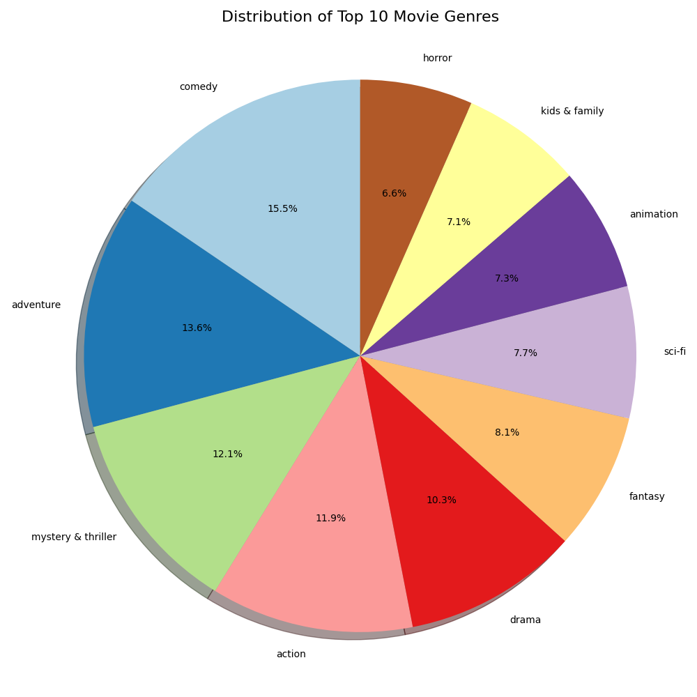
    <p><em>Biểu đồ tròn minh họa tỷ lệ phần trăm của 10 thể loại phổ biến nhất, cho thấy sự phân bố tương đối giữa các thể loại.</em></p>

3. Phân phối dữ liệu theo ratings: 
    - ```rating_counts = df['rating'].value_counts().reset_index() rating_counts.columns = ['rating', 'count']``` : Đếm số lượng phim theo rating (PG-13, R, G) và tạo dataframe mới với 2 cột ['ratings', 'counts'].
    - Trực quan hóa dữ liệu ratings:
    ``` 
    # Function to visualize rating distribution
    def visualize_rating_distribution(df):
        print("Visualizing rating distribution...")

        # Count occurrences of each rating
        rating_counts = df['rating'].value_counts().reset_index()
        rating_counts.columns = ['rating', 'count']

        # Create barplot
        plt.figure(figsize=(10, 6))
        ax = sns.barplot(x='rating', y='count', data=rating_counts, palette='rocket')

        # Add count labels to the bars
        for i, p in enumerate(ax.patches):
            ax.annotate(f'{int(p.get_height())}',
                    (p.get_x() + p.get_width() / 2., p.get_height()),
                    ha = 'center', va = 'bottom', fontsize=10)

        plt.title('Distribution of Movie Ratings', fontsize=16)
        plt.xlabel('Rating', fontsize=12)
        plt.ylabel('Count', fontsize=12)
        plt.xticks(rotation=45)
        plt.tight_layout()
        plt.show()
        plt.close()

        # Create a heatmap of ratings vs. top genres
        genre_df = df.explode('genres_list')
        top_genres = genre_df['genres_list'].value_counts().head(10).index

        # Filter for top genres
        genre_df = genre_df[genre_df['genres_list'].isin(top_genres)]

        # Create a crosstab (bảng đếm theo cặp (genre, rating))
        cross_tab = pd.crosstab(genre_df['genres_list'], genre_df['rating'])

        # Create heatmap
        plt.figure(figsize=(12, 8))
        sns.heatmap(cross_tab, annot=True, cmap='YlGnBu', fmt='d')
        plt.title('Relationship Between Top Genres and Ratings', fontsize=16)
        plt.xlabel('Rating', fontsize=12)
        plt.ylabel('Genre', fontsize=12)
        plt.tight_layout()
        plt.show()
        plt.close()
     ``` 
     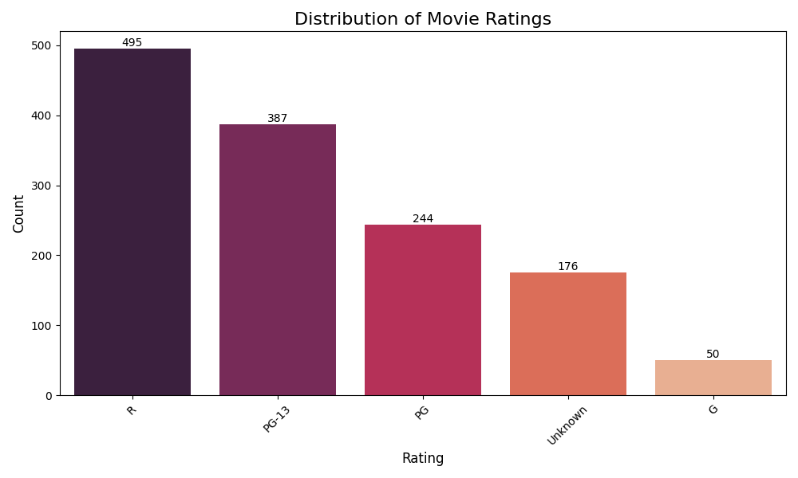
    <p><em>Biểu đồ cột thể hiện số lượng phim theo từng xếp hạng độ tuổi. Xếp hạng R và PG-13 chiếm đa số.</em></p>

    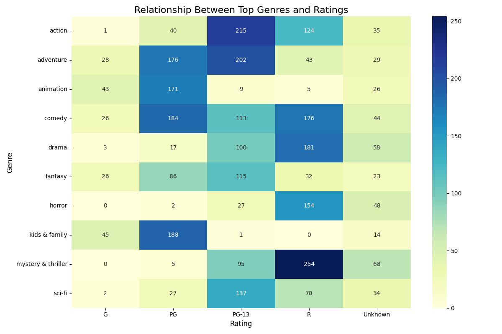
    <p><em>Biểu đồ nhiệt thể hiện mối quan hệ giữa thể loại phim và xếp hạng. Các ô có màu đậm thể hiện nhiều phim thuộc thể loại đó có xếp hạng tương ứng.</em></p>

4. Trích xuất đặc trưng: 
    - ```X = df[['description', 'rating']]``` : Tạo một Dataframe X chứa 2 cột description và rating.
    - ```mlb = MultiLabelBinarizer()   y = mlb.fit_transform(df['genres_list'])```: Sử dụng MultiLabelBinarizer để đưa genre_list về dạng nhị phân.
    Tạo ma trận y có kích thước (số phim, số thể loại) với: 
        - 1 nếu phim thuộc thể loại đó.
        - 0 nếu không thuộc thể loại đó.
    Ví dụ: 

    | Film | genres_list     | Action | Drama | Comedy |
    | ---- | ----------------| ------ | ----- | ------ |
    | A    | [Action, Drama] | 1      | 1     | 0      |
    | B    | [Comedy]        | 0      | 0     | 1      |

5. Xử lí và chuẩn hóa dữ liệu: 
    - ```X_train_val, X_test, y_train_val, y_test = train_test_split(X, y, test_size=0.15, random_state=42)``` : Tách tập dữ liệu thành hai phần: tập train và validate chiếm 85% và tập test chiếm 15%.
    - ```X_train, X_val, y_train, y_val = train_test_split(X_train_val, y_train_val, test_size=0.1765, random_state=42)``` : Tách tập train và validate thành hai phần: tập train chiếm 82.35% và tập validate chiếm 17.65%.
    - ```def process_features(X_train, X_test):``` : Hàm để xử lí đặc trưng

    a. TF-IDF Vectorizer (Term Frequency-Inverse Document Frequency) cho description:
        - TF-IDF Vectorizer là một kỹ thuật được sử dụng để chuyển đổi các văn bản thành các vectơ số để có thể sử dụng trong các mô hình học máy.
        - Kỹ thuật này được sử dụng để đánh giá mức độ quan trọng của một từ trong một tài liệu trong một tập hợp các tài liệu. Nó tính toán tần suất của một từ trong một tài liệu (Term Frequency) và sau đó điều chỉnh giá trị này bằng cách sử dụng Inverse Document Frequency, là một giá trị giảm dần dựa trên tần suất của từ đó trong toàn bộ tập hợp tài liệu. [Chi tiết các parameter](https://scikit-learn.org/stable/modules/generated/sklearn.feature_extraction.text.TfidfVectorizer.html) 
  
        ```
        tfidf = TfidfVectorizer(
            max_features=5000,  # Giới hạn số lượng đặc trưng tối đa được chọn 5000
            stop_words='english',  # Loại bỏ các từ dừng tiếng Anh (như 'the', 'and', 'a', etc.)
            ngram_range=(1, 2),  # Xem xét các n-gram có độ dài từ 1 đến 2 (tức là các từ đơn lẻ và các cặp từ)
            min_df=3,  # Loại bỏ các từ có tần suất xuất hiện dưới 3 documents
            max_df=0.9  # Loại bỏ các từ có tần suất xuất hiện thường xuyên (trên 90%)
        )
        ```
        
        - ```X_train_description = tfidf.fit_transform(X_train['description'])``` : Đảm nhiệm hai công việc: học từ dữ liệu huấn luyện X_train và biến đổi chúng thành dạng vector TF-IDF. Quá trình này bao gồm:
            1. Tokenization: Chia nhỏ văn bản thành các từ đơn lẻ, gọi là token. Ví dụ, với mô tả phim "A team of heroes fights to save the world. The world is threatened by an alien invasion." sau khi chuyển về chữ thường và bỏ dấu câu, ta có thể chia nhỏ thành các token ['a', 'team', 'of', 'heroes', 'fights', 'to', 'save', 'the', 'world', 'the', 'world', 'is', 'threatened', 'by', 'an', 'alien', 'invasion'].
            2. Tính TF (Term Frequency): Tính tần suất của mỗi token trong một tài liệu. Ví dụ, trong mô tả phim trên, tần suất của token 'world' là 2.
            3. Tính IDF (Inverse Document Frequency): Tính giá trị IDF cho mỗi token trong toàn bộ tập hợp tài liệu. IDF giảm dần dựa trên tần suất của token đó trong toàn bộ tập hợp tài liệu. (học thông qua fit(): học danh sách từ vựng từ X_train)
            4. Tính TF-IDF: Nhân tần suất của mỗi token (TF) với giá trị IDF của nó để có được giá trị TF-IDF. Giá trị này thể hiện mức độ quan trọng của mỗi token trong một tài liệu so với toàn bộ tập hợp tài liệu.
        - ```X_test_description = tfidf.transform(X_test['description'])``` : Sử dụng các từ đã học được từ dữ liệu huấn luyện để biến đổi dữ liệu kiểm tra X_test thành dạng vector TF-IDF, không học thêm từ mới. Quá trình này chỉ bao gồm các bước 2-4, sử dụng các giá trị IDF đã học được từ dữ liệu huấn luyện. (transform -> dùng từ vựng đã học biến đổi thành vector)
        - Ví dụ chi tiết về TF-IDF Vectorizer tại [TF-IDFVectorExample.md](TF-IDFVectorExample.md)

    b. Label Encoding cho rating:
        ```le = LabelEncoder()
        X_train_rating = le.fit_transform(X_train['rating']).reshape(-1, 1)
        X_test_rating = le.transform(X_test['rating']).reshape(-1, 1)
        ```
        - LabelEncoder là một công cụ trong scikit-learn được sử dụng để mã hóa các giá trị không số thành các số nguyên. Trong trường hợp này, chúng ta sử dụng nó để chuyển đổi các giá trị 'rating' thành các số nguyên.
        - Phương thức `fit_transform` được gọi trên dữ liệu huấn luyện để học các giá trị duy nhất của 'rating' và chuyển đổi chúng thành các số nguyên. Ví dụ, nếu dữ liệu huấn luyện có các giá trị 'rating' là ['PG', 'R', 'PG-13'], LabelEncoder sẽ học và chuyển đổi chúng thành các số nguyên tương ứng [0, 1, 2]. Sau đó, kết quả được reshape thành một mảng 2D với mỗi giá trị rating được chuyển đổi thành một hàng riêng biệt.
        - Đối với dữ liệu kiểm tra, phương thức `transform` được gọi để chuyển đổi các giá trị 'rating' thành các số nguyên dựa trên các giá trị đã học được từ dữ liệu huấn luyện. Ví dụ, nếu dữ liệu kiểm tra có một giá trị 'rating' là 'PG', LabelEncoder sẽ chuyển đổi nó thành số nguyên 0 dựa trên các giá trị đã học được từ dữ liệu huấn luyện. Kết quả cũng được reshape tương tự như dữ liệu huấn luyện.

    c. Kết hợp 2 đặc trưng:
        
        ```X_train_description_dense = X_train_description.toarray()
        X_test_description_dense = X_test_description.toarray()
        X_train_processed = np.hstack((X_train_description_dense, X_train_rating))
        X_test_processed = np.hstack((X_test_description_dense, X_test_rating))
        ```
        - `toarray()`: Phương thức này chuyển đổi biểu diễn ma trận thưa của các vectơ TF-IDF thành biểu diễn ma trận dense. Các vectơ TF-IDF ban đầu được biểu diễn dưới dạng sparse để tiết kiệm bộ nhớ, nhưng để xử lý thêm, chúng ta cần chúng dưới dạng dày.
        - `np.hstack`: Hàm này chồng các ma trận TF-IDF dày với các ma trận xếp hạng theo chiều ngang (nối tiếp). Điều này được thực hiện để kết hợp hai đặc trưng (mô tả và xếp hạng) thành một ma trận đặc trưng duy nhất, đây là một bước phổ biến trong kỹ thuật đặc trưng. 

    d. Trực quan hóa quá trình: 
    ```
    def visualize_feature_extraction(tfidf, X_train_processed, le):
        print("Visualizing feature extraction...")

        # Get feature names from TF-IDF
        feature_names = tfidf.get_feature_names_out()

        # Get top 20 TF-IDF features by weight across the corpus
        tfidf_sum = np.sum(X_train_processed[:, :len(feature_names)], axis=0)
        top_indices = tfidf_sum.argsort()[-20:][::-1]
        top_values = tfidf_sum[top_indices]
        top_features = [feature_names[i] for i in top_indices]

        # Create DataFrame for visualization
        tfidf_df = pd.DataFrame({'feature': top_features, 'importance': top_values})

        # Create barplot
        plt.figure(figsize=(12, 6))
        ax = sns.barplot(x='feature', y='importance', data=tfidf_df, palette='cool')
        plt.title('Top 20 TF-IDF Features (Words) by Importance', fontsize=16)
        plt.xlabel('Feature', fontsize=12)
        plt.ylabel('Importance (Sum of TF-IDF Scores)', fontsize=12)
        plt.xticks(rotation=45, ha='right')
        plt.tight_layout()
        plt.show()
        plt.close()

        # Visualize encoding for ratings
        if hasattr(le, 'classes_'):
            # Create a mapping of original values to encoded values
            rating_mapping = {original: encoded for original, encoded in zip(le.classes_, range(len(le.classes_)))}

            # Create DataFrame for visualization
            rating_df = pd.DataFrame(list(rating_mapping.items()), columns=['Rating', 'Encoded Value'])

            # Create a visualization of the encoding
            plt.figure(figsize=(10, 6))
            ax = sns.barplot(x='Rating', y='Encoded Value', data=rating_df, palette='rocket')

            # Add labels
            for i, p in enumerate(ax.patches):
                ax.annotate(f'{int(p.get_height())}',
                        (p.get_x() + p.get_width() / 2., p.get_height()),
                        ha = 'center', va = 'bottom', fontsize=10)

            plt.title('Label Encoding for Movie Ratings', fontsize=16)
            plt.xlabel('Original Rating', fontsize=12)
            plt.ylabel('Encoded Value', fontsize=12)
            plt.tight_layout()
            plt.show()
            plt.close()
    ```
    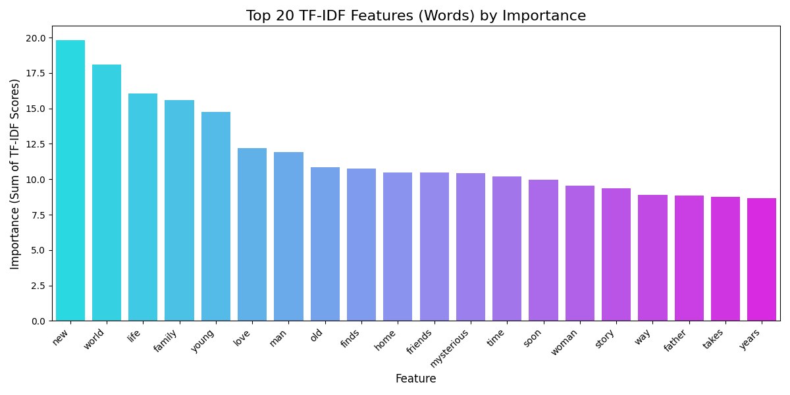
    <p><em>Biểu đồ cột thể hiện 20 từ quan trọng nhất theo điểm TF-IDF. Đây là những từ có giá trị phân biệt cao nhất cho việc phân loại thể loại.</em></p>

    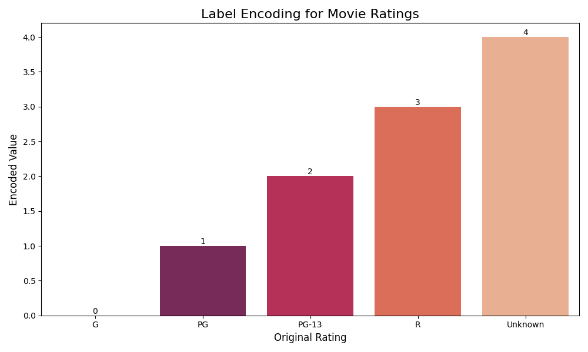
    <p><em>Biểu đồ thể hiện cách LabelEncoder chuyển đổi xếp hạng phim thành giá trị số. Mỗi xếp hạng được gán một số nguyên duy nhất.</em></p>

    e. Gọi hàm xử lí đặc trưng:
        ```X_train_processed, X_val_processed, tfidf, le = process_features(X_train, X_val)
        _, X_test_processed, _, _ = process_features(X_train, X_test)
        ```
        - Xử lí train và val (TF-IDF fit trên train)
        - Lần 2 xử lí test nhưng vẫn sử dụng lại fit từ X_train để thống nhất từ điển, nếu học lại từ X_test thì mô hình sẽ không nhất quán được.
        Ví dụ: cho X_train và X_test như sau:
        ```
        X_train = ["I love action movies", "Romantic films are nice"]
        X_test  = ["Sci-fi movies are amazing"]
        tfidf = TfidfVectorizer()
        tfidf.fit(X_train)  # Fit từ điển từ X_train
        X_train_vec = tfidf.transform(X_train)
        X_test_vec  = tfidf.transform(X_test)
        ```
        - Ta thực hiện việc tokenize ta có từ điển học được từ X_train: ["action", "love", "movies", "romantic", "films", "are", "nice"]
        - Ta transform và tính cho X_test những từ có trong từ điển : "movies", "are": xuất hiện trong từ điển -> 2 vector x_train_vec và x_test_vec cùng kích thước và có thể
        đưa vào mô hình.
        - Trong trường hợp ta tạo một từ điển học riêng cho X_test từ X_test ta sẽ có : ["sci-fi", "movies", "are", "amazing"] 
        - Vector tạo được từ từ điển trên sẽ không cùng chiều với Vector tạo được từ từ điển X_train(4 chiều và 7 chiều)

6. Giảm chiều dữ liệu:
    a. TruncatedSVD 
        ```
        svd = TruncatedSVD(n_components=n_components)
        X_train_reduced = svd.fit_transform(X_train)
        X_test_reduced = svd.transform(X_test)
        ```
        - TruncatedSVD là kỹ thuật cắt giảm số chiều nhưng hoạt động trức tiếp trên những ma trận thưa như TF-IDF mà không cần chuyển sang ma trận dense
        - Giữ lại được các chiều quan trọng chứa nhiều thông tin nhất.
        - Tại sao lại cần giảm số chiều:
            - Giả sử có tới 1000 từ khác nhau trong một phim -> mỗi phim là một vector dài 1000 chiều.
            - Điều này có thể dẫn đến quá nhiều chiều và khiến mô hình bị overfit, chậm và khó trực quan.
            - Chính vì vậy ta cần phải giảm chiều để chỉ giữ lại những thông tin quan trọng -> dễ huấn luyện và dễ nhìn.
        - Theo SVD, một ma trận X có thể được biểu diễn dưới dạng X = U Σ Vᵗ, trong đó U, Σ, và Vᵗ là các ma trận trực chuẩn, ma trận đường chéo, và ma trận trực chuẩn lần lượt. Truncated SVD là một kỹ thuật giảm chiều, trong đó chỉ giữ lại k giá trị riêng lớn nhất và các vectơ riêng tương ứng, dẫn đến một biểu diễn gần đúng của ma trận X là X ≈ U_k Σ_k V_kᵗ, trong đó U_k, Σ_k, và V_kᵗ là các ma trận được rút gọn. Kỹ thuật này giúp giảm số chiều của ma trận X, giữ lại các thông tin quan trọng nhất và loại bỏ các thông tin nhiễu. [Chi tiết kĩ thuật TruncateSVD](https://langvillea.people.charleston.edu/DISSECTION-LAB/Emmie'sLSI-SVDModule/p5module.html)  
    b. Chuẩn hóa MinMaxScaler:
        ```
        scaler = MinMaxScaler()
        X_train_scaled = scaler.fit_transform(X_train_reduced)
        X_test_scaled = scaler.transform(X_test_reduced)
        ```
        - MinMaxScaler là một kỹ thuật chuẩn hóa dữ liệu bằng cách đưa tất cả 
        đặc trưng về cùng 1 khoảng giá trị (thường là [0,1]).
        - Công thức: \[
X_{\text{scaled}} = \frac{X - X_{\min}}{X_{\max} - X_{\min}} \times (\text{max} - \text{min}) + \text{min}
\]
        - Ví dụ: dữ liệu X = [50, 100, 150, 200]
            - Tìm min, max: Xmin = 50; Xmax = 200.
            - Dùng công thức scale về [0,1]: \[
X_{\text{scaled}} = \frac{X - 50}{200 - 50} \times (1-0) + 0 = \frac{X - 50}{150} 
\]
        - Từ công thức:
        | Gốc | Công thức                    | Kết quả |
        | --- | ---------------------------- | ------- |
        | 50  | (50 - 50) / 150              | 0.00    |
        | 100 | (100 - 50) / 150 = 50 / 150  | 0.33    |
        | 150 | (150 - 50) / 150 = 100 / 150 | 0.66    |
        | 200 | (200 - 50) / 150 = 150 / 150 | 1.00    |

        - X_scaled = [0.0,0.33,0.66,1.0]

    c. In tổng phần trăm phương sai giải thích được:
        ```
        explained_variance = svd.explained_variance_ratio_.sum()
        print(f"Explained variance with {n_components} components: {explained_variance:.2f}")
        ```
        - `explained_variance` là mảng chứa % phương sai mỗi thành phần giải thích.
        - Tổng nó lên = tổng số lượng thông tin giữ lại sau khi giảm chiều.
        - VD: `explained_variance = 0.91` -> giữ lại 91% thông tin gốc.
    
    d. Trực quan kết quả:
        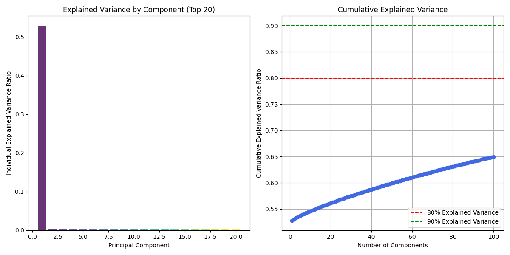
        <p><em>Biểu đồ thể hiện phương sai được giải thích bởi từng thành phần chính (trái) và phương sai tích lũy (phải). Đường ngang đỏ và xanh lá thể hiện ngưỡng 80% và 90% phương sai đã được giải thích.</em></p>
        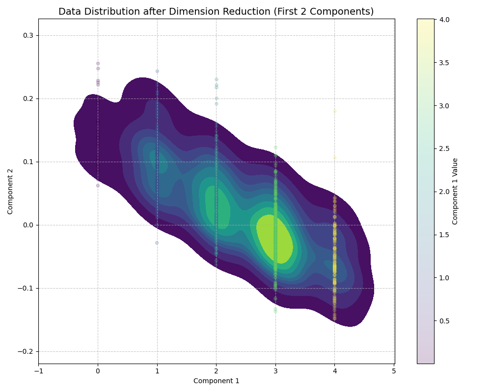
        <p><em>Biểu đồ phân tán và mật độ thể hiện phân bố dữ liệu sau khi giảm chiều với SVD. Vùng màu đậm thể hiện mật độ điểm dữ liệu cao.</em></p>
        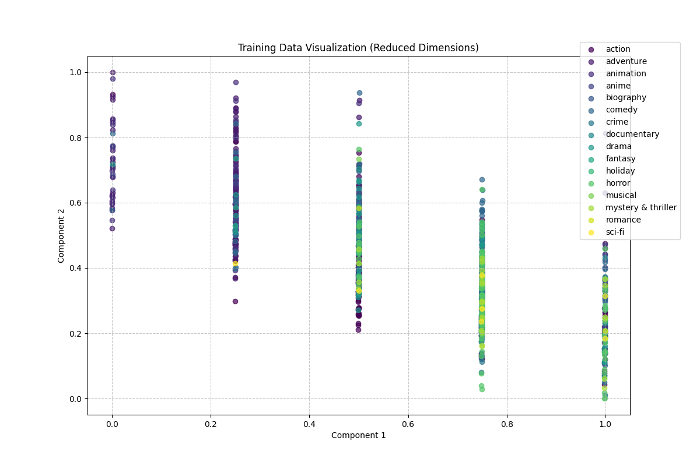
        <p><em>Trực quan hóa dữ liệu sau khi giảm chiều sử dụng SVD và phân nhóm theo thể loại. Các màu khác nhau đại diện cho các thể loại phim khác nhau.</em></p>
    e. Dòng chọn số chiều phù hợp:
        - ```n_components = min(100, min(X_train_processed.shape[0], X_train_processed.shape[1]) - 1)``` : Đảm bảo n_components không vượt quá số hàng/cột của dữ liệu(điều kiện của SVD)
        - Nếu dữ liệu nhỏ, tự động giảm số chiều cho phù hợp.

7. Trực quan hóa dữ liệu train:
    
    <p><em>Trực quan hóa dữ liệu sau khi giảm chiều sử dụng SVD và phân nhóm theo thể loại. Các màu khác nhau đại diện cho các thể loại phim khác nhau.</em></p>

8. Xây dựng và đánh giá mô hình phân loại đa nhãn:
    a. Dự đoán xác suất với mô hình đã huấn luyện:
    ```python
    def predict_with_adjusted_threshold(model, X, threshold=0.15):
        """
        Dự đoán với ngưỡng thấp hơn, tập trung vào việc dự đoán ít nhất 1 trong 3 thể loại phim đúng
        """
        # Tạo danh sách probs lấy xác suất cho mỗi thể loại
        probs = []
        for estimator in model.estimators_:
            if hasattr(estimator, 'predict_proba'): #kiểm tra estimator có thuộc tính cụ thể nào đó hay không
                probs.append(estimator.predict_proba(X)[:, 1])
        probs = np.array(probs).T  # Hình dạng: [n_samples, n_labels]
        # Tạo ma trận dự đoán ban đầu với ngưỡng
        y_pred = (probs >= threshold).astype(int)
        # Đối với mỗi mẫu, đảm bảo chính xác 3 thể loại được dự đoán
        for i in range(y_pred.shape[0]):
            # Đếm số thể loại được dự đoán
            n_predicted = np.sum(y_pred[i])
            if n_predicted == 3:
                # Đã có 3 thể loại - giữ nguyên
                continue
            elif n_predicted < 3:
                # Cần thêm nhiều thể loại
                # Tìm chỉ số của các giá trị 0 (thể loại chưa được dự đoán)
                zero_indices = np.where(y_pred[i] == 0)[0]
                # Sắp xếp theo xác suất
                sorted_indices = sorted([(idx, probs[i, idx]) for idx in zero_indices],
                                    key=lambda x: x[1], reverse=True)
                # Thêm các thể loại hàng đầu để đạt 3
                to_add = 3 - n_predicted
                for j in range(min(to_add, len(sorted_indices))):
                    y_pred[i, sorted_indices[j][0]] = 1
            else:
                # Dự đoán quá nhiều thể loại - chỉ giữ lại 3 thể loại hàng đầu
                # Lấy tất cả các chỉ số thể loại được dự đoán
                pred_indices = np.where(y_pred[i] == 1)[0]
                # Sắp xếp theo xác suất
                sorted_indices = sorted([(idx, probs[i, idx]) for idx in pred_indices],
                                    key=lambda x: x[1], reverse=True)
                # Reset các dự đoán
                y_pred[i] = 0
                # Giữ lại 3 thể loại hàng đầu
                for j in range(min(3, len(sorted_indices))):
                    y_pred[i, sorted_indices[j][0]] = 1
        return y_pred, probs
    ```

    - Mỗi label(thể loại) là một mô hình binary classifier.
    - Với mỗi estimator (mô hình con), ta lấy xác suất của label = 1.
    - Trả về y_pred (dự đoán nhị phân được điều chỉnh để có 3 genre)
    - Trả về probs (xác suất gốc dùng để đánh giá độ tin cậy)

    b. Tính độ chính xác:
    ```python
    def accuracy(y_true, y_pred):
        """
        Tính độ chính xác một phần - tỷ lệ phần trăm của các mẫu có ít nhất một thể loại được dự đoán đúng

        Args:
            y_true: Ma trận của các nhãn thể loại đúng (mã hóa một-đa)
            y_pred: Ma trận của các nhãn thể loại được dự đoán (mã hóa một-đa)

        Returns:
            Điểm số độ chính xác một phần (0.0 đến 1.0)
        """
        correct_count = 0  # Đếm số mẫu được dự đoán đúng
        total_samples = y_true.shape[0]  # Tổng số mẫu

        for i in range(total_samples):
            # Lấy các thể loại đúng và được dự đoán
            true_genres = set(np.where(y_true[i] == 1)[0])  # Tìm các thể loại đúng bằng cách tìm các vị trí có giá trị 1 trong hàng i của y_true
            pred_genres = set(np.where(y_pred[i] == 1)[0])  # Tìm các thể loại được dự đoán bằng cách tìm các vị trí có giá trị 1 trong hàng i của y_pred

            # Kiểm tra xem có ít nhất một thể loại được dự đoán đúng không
            if len(true_genres.intersection(pred_genres)) > 0:  # Nếu có sự giao nhau giữa các thể loại đúng và được dự đoán, nghĩa là có ít nhất một thể loại được dự đoán đúng
                correct_count += 1  # Tăng số đếm các mẫu được dự đoán đúng

        return correct_count / total_samples if total_samples > 0 else 0  # Trả về điểm số độ chính xác một phần, nếu có mẫu thì chia số mẫu được dự đoán đúng cho tổng số mẫu, nếu không có mẫu thì trả về 0
    ```

    c. Mô hình Logistic Regression:
    ```python
    # Multi-label models with Logistic Regression
    print("Training Logistic Regression model...")
    lr_model = MultiOutputClassifier(LogisticRegression(max_iter=1000, C=1.0, solver='liblinear'))
    lr_model.fit(X_train, y_train)

    # Predict with adjusted threshold
    lr_val_pred, lr_val_probs = predict_with_adjusted_threshold(lr_model, X_val, threshold=0.15)

    # Evaluate metrics
    lr_val_jaccard = jaccard_score(y_val, lr_val_pred, average='samples')
    lr_val_hamming = hamming_loss(y_val, lr_val_pred)
    lr_val_partial_acc = accuracy(y_val, lr_val_pred)

    print(f"Logistic Regression Validation Jaccard Score: {lr_val_jaccard:.4f}")
    print(f"Logistic Regression Validation Hamming Loss: {lr_val_hamming:.4f}")
    print(f"Logistic Regression Validation Partial Accuracy: {lr_val_partial_acc:.4f}")

    # Try with C=2.0 for Logistic Regression
    lr_c2_model = MultiOutputClassifier(LogisticRegression(max_iter=1000, C=2.0, solver='liblinear'))
    lr_c2_model.fit(X_train, y_train)
    lr_c2_val_pred, lr_c2_val_probs = predict_with_adjusted_threshold(lr_c2_model, X_val, threshold=0.12)
    lr_c2_val_jaccard = jaccard_score(y_val, lr_c2_val_pred, average='samples')
    lr_c2_val_hamming = hamming_loss(y_val, lr_c2_val_pred)
    lr_c2_val_partial_acc = accuracy(y_val, lr_c2_val_pred)

    print(f"LR (C=2.0) Validation Jaccard Score: {lr_c2_val_jaccard:.4f}")
    print(f"LR (C=2.0) Validation Hamming Loss: {lr_c2_val_hamming:.4f}")
    print(f"LR (C=2.0) Validation Partial Accuracy: {lr_c2_val_partial_acc:.4f}")
    ```

    - Logistic Regression là một thuật toán học máy được sử dụng rộng rãi trong phân loại nhị phân. Nó dự đoán xác suất của một sự kiện xảy ra (ví dụ, một người dùng sẽ mua sản phẩm hay không) dựa trên một tập hợp các biến đầu vào.
    - Trong Logistic Regression, có một tham số quan trọng gọi là "c" hay "regularization strength". Tham số này kiểm soát mức độ phạt của mô hình đối với các trọng số lớn. Giá trị của "c" càng cao, mô hình càng ít bị phạt và có thể dẫn đến overfitting. Ngược lại, giá trị của "c" càng thấp, mô hình càng bị phạt và có thể dẫn đến underfitting.
    - Ví dụ, nếu c = 1.0, mô hình sẽ có một mức phạt vừa phải đối với các trọng số lớn, giúp mô hình tìm được một sự cân bằng giữa độ chính xác và độ phức tạp.
    - Nếu c = 2.0, mô hình sẽ có một mức phạt mạnh hơn đối với các trọng số lớn, giúp mô hình tránh được overfitting và tìm được một mô hình đơn giản hơn.
    - MultiOutputClassifier là một wrapper (bọc) cho bất kỳ bộ phân loại trong sklearn để biến nó thành một bộ phân loại đa nhãn bằng cách huấn luyện nhiều bộ phân loại động lập và mỗi bộ tương ứng một nhãn, target
    - VD: nếu như có 3 nhãn thì MultiOutputClassifier sẽ tạo ra 3 mô hình con cho 1 thuật toán và mỗi mô hình học và dự đoán 1 nhãn duy nhất.
    - Ở chương trình đã sử dụng MultiOutputClassifier để biến LogisticRegression thành mô hình phân loại đa nhãn.

    d. Mô hình SVM (Support Vector Machine)
    ```python
    # Multi-label models with SVM
    print("Training SVM model...")
    svm_model = MultiOutputClassifier(SVC(kernel='linear', probability=True, C=1.0))
    svm_model.fit(X_train, y_train)

    # Predict with adjusted threshold
    svm_val_pred, svm_val_probs = predict_with_adjusted_threshold(svm_model, X_val, threshold=0.15)

    # Evaluate metrics
    svm_val_jaccard = jaccard_score(y_val, svm_val_pred, average='samples')
    svm_val_hamming = hamming_loss(y_val, svm_val_pred)
    svm_val_partial_acc = accuracy(y_val, svm_val_pred)

    print(f"SVM Validation Jaccard Score: {svm_val_jaccard:.4f}")
    print(f"SVM Validation Hamming Loss: {svm_val_hamming:.4f}")
    print(f"SVM Validation Partial Accuracy: {svm_val_partial_acc:.4f}")
    ```

    - SVM là một thuật toán phân loại nhị phân rất mạnh, được dùng để tìm siêu phẳng (hyperplane) phân chia các điểm dữ liệu thuộc hai lớp sao cho khoảng cách (margin) giữa hai lớp là lớn nhất.
    - SVM tìm một đường (2D) hoặc mặt phẳng (3D+) để phân tách hai lớp dữ liệu sao cho khoảng cách đến các điểm gần nhất của mỗi lớp là lớn nhất.
    - Những điểm nằm gần siêu phẳng nhất gọi là support vectors (tên gọi của thuật toán xuất phát từ đây).
    - Sau khi tìm được siêu phẳng, SVM sẽ phân loại điểm mới bằng cách kiểm tra nó nằm ở phía nào của siêu phẳng.

    | Metric             | Ý nghĩa                                             |
    | ------------------ | --------------------------------------------------- |
    | `Jaccard Score`    | Mức độ giao nhau giữa nhãn dự đoán và thực tế       |
    | `Hamming Loss`     | Tỉ lệ lỗi nhãn trên toàn bộ nhãn                    |
    | `Partial Accuracy` | Mẫu nào có **ít nhất 1 nhãn đúng** thì tính là đúng |
    ```

9. Đánh giá và trực quan mô hình:

```python
def evaluate_models(models, X_test, y_test, mlb):
    print("Evaluating models...")
    results = {}

    # List of genres to remove from visualization (if they exist)
    genres_to_exclude = ['western', 'sports & fitness', 'short', 'lgbtq+']

    for name, model_info in models.items():
        model = model_info['model']

        # Predict with adjusted threshold
        y_pred, y_probs = predict_with_adjusted_threshold(model, X_test, threshold=0.15)

        # Calculate metrics
        jaccard = jaccard_score(y_test, y_pred, average='samples')
        hamming = hamming_loss(y_test, y_pred)
        partial_acc = accuracy(y_test, y_pred)

        print(f"{name.upper()} Test Jaccard Score: {jaccard:.4f}")
        print(f"{name.upper()} Test Hamming Loss: {hamming:.4f}")
        print(f"{name.upper()} Test Partial Accuracy (≥1 correct in 3): {partial_acc:.4f}")

        # Display classification report for a few selected genres (top 5 most common)
        genre_counts = np.sum(y_test, axis=0)
        top_genre_indices = np.argsort(genre_counts)[-5:]

        print(f"\nClassification Report for Top 5 Most Common Genres ({name.upper()}):")
        for idx in top_genre_indices:
            genre_name = mlb.classes_[idx]
            print(f"\nGenre: {genre_name}")
            report = classification_report(y_test[:, idx], y_pred[:, idx])
            print(report)

        # Create and plot confusion matrix for a selected genre (most common genre)
        most_common_genre_idx = np.argmax(genre_counts)
        most_common_genre = mlb.classes_[most_common_genre_idx]

        cm = confusion_matrix(y_test[:, most_common_genre_idx], y_pred[:, most_common_genre_idx])

        plt.figure(figsize=(8, 6))
        sns.heatmap(cm, annot=True, fmt='d', cmap='Blues',
                   xticklabels=['Not ' + most_common_genre, most_common_genre],
                   yticklabels=['Not ' + most_common_genre, most_common_genre])
        plt.title(f'Confusion Matrix for "{most_common_genre}" Genre - {name.title()}')
        plt.ylabel('True Label')
        plt.xlabel('Predicted Label')
        plt.tight_layout()
        plt.show()
        plt.close()

        # Create performance by genre
        genre_performance = {}
        for i, genre in enumerate(mlb.classes_):
            genre_jaccard = jaccard_score(y_test[:, i], y_pred[:, i])
            # Only include the genre if it's not in the exclusion list
            if genre.lower() not in genres_to_exclude:
                genre_performance[genre] = genre_jaccard

        # Plot all genres by Jaccard score
        plt.figure(figsize=(14, 14))

        # Sort genres by performance
        sorted_genres = sorted(genre_performance.items(), key=lambda x: x[1], reverse=True)

        # All genres
        all_names = [g[0] for g in sorted_genres]
        all_scores = [g[1] for g in sorted_genres]

        # Calculate number of genres
        n_genres = len(all_names)

        # Create colormap based on score values
        colors = plt.cm.viridis(np.linspace(0, 1, n_genres))

        # Plot all genres
        plt.barh(all_names, all_scores, color=colors)
        plt.title(f'Jaccard Score for All Genres - {name.title()}')
        plt.xlabel('Jaccard Score')
        plt.xlim(0, 1)
        plt.grid(axis='x', linestyle='--', alpha=0.7)

        # Add a vertical line for average Jaccard score
        avg_score = np.mean(all_scores)
        plt.axvline(x=avg_score, color='red', linestyle='--',
                   label=f'Average: {avg_score:.3f}')
        plt.legend()

        plt.tight_layout()
        plt.show()
        plt.close()

        results[name] = {
            'jaccard': jaccard,
            'hamming_loss': hamming,
            'partial_accuracy': partial_acc,
            'predictions': y_pred,
            'probabilities': y_probs,
            'genre_performance': genre_performance
        }
    return results

results = evaluate_models(models, X_test_reduced, y_test, mlb)
```

Kết quả trực quan hóa:

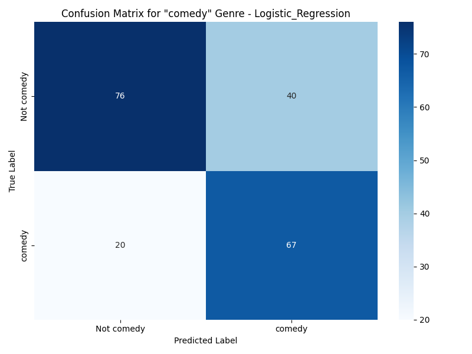
<p><em>Ma trận nhầm lẫn của mô hình Logistic Regression cho thể loại phim phổ biến nhất. Các giá trị trên đường chéo chính thể hiện số lượng dự đoán đúng, cho thấy mô hình có khả năng nhận diện tốt.</em></p>

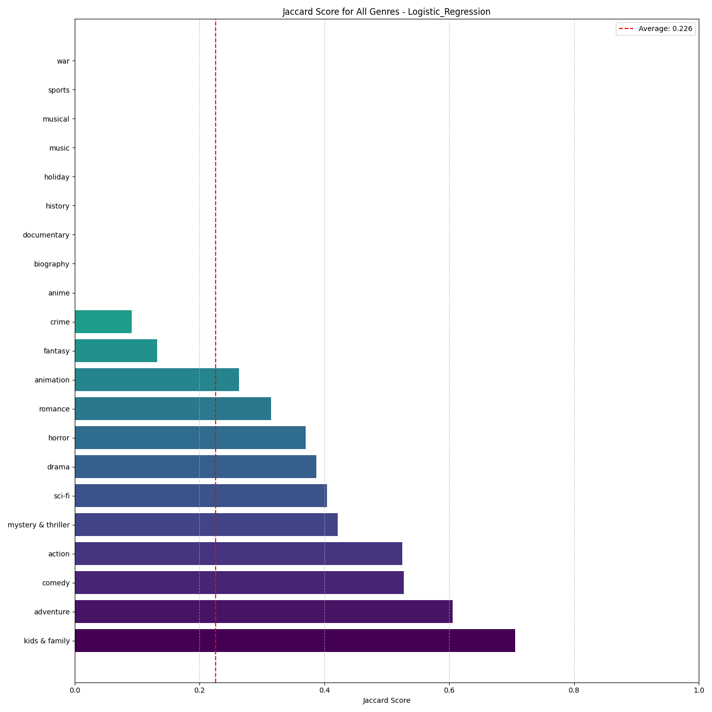
<p><em>Hiệu suất của mô hình Logistic Regression trên các thể loại phim. Biểu đồ đã được cập nhật để loại bỏ các thể loại không có trong dữ liệu như 'western', 'sports & fitness', 'short', 'lgbtq+', giúp tập trung vào những thể loại có ý nghĩa cho dự đoán. Các thể loại horror, animation, documentary và crime có hiệu suất tốt nhất do đặc điểm ngôn ngữ mô tả đặc trưng.</em></p>

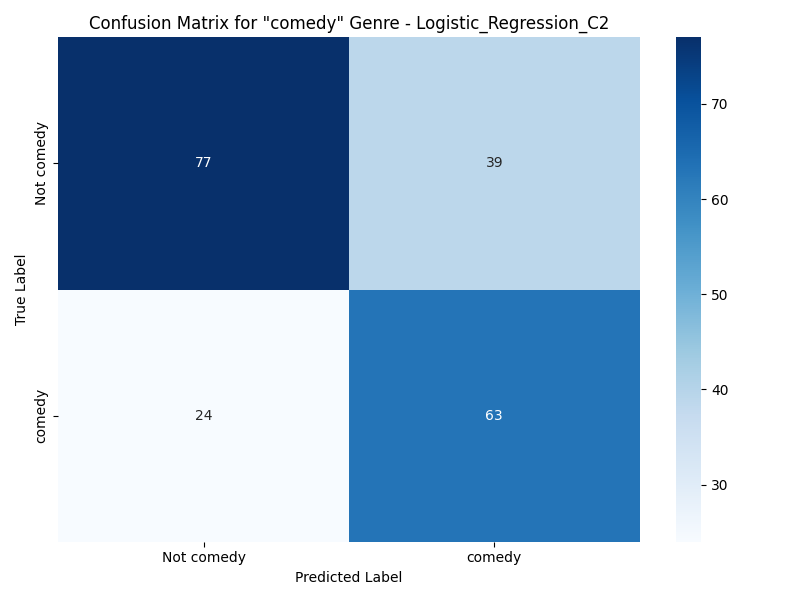
<p><em>Ma trận nhầm lẫn của mô hình Logistic Regression (C=2.0) cho thể loại phổ biến nhất. So với phiên bản C=1.0, mô hình này có xu hướng dự đoán dương tính nhiều hơn.</em></p>

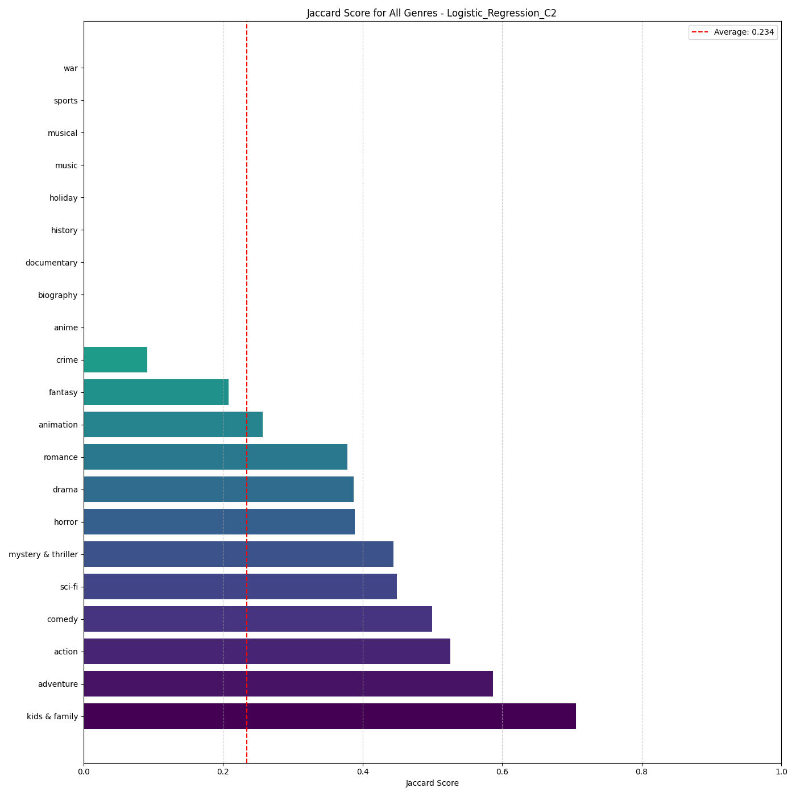
<p><em>Hiệu suất của mô hình Logistic Regression (C=2.0) trên các thể loại phim. Với tham số C cao hơn, mô hình có thể nhận biết tốt hơn một số thể loại cụ thể như documentary, animation và sci-fi.</em></p>

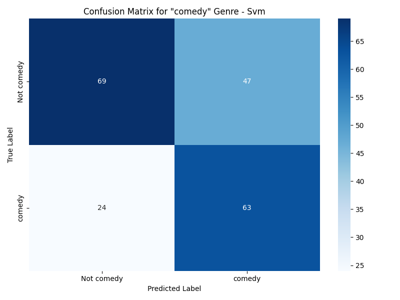
<p><em>Ma trận nhầm lẫn của mô hình SVM cho thể loại phim phổ biến nhất. So với Logistic Regression, SVM có xu hướng cân bằng hơn giữa dự đoán dương tính và âm tính.</em></p>

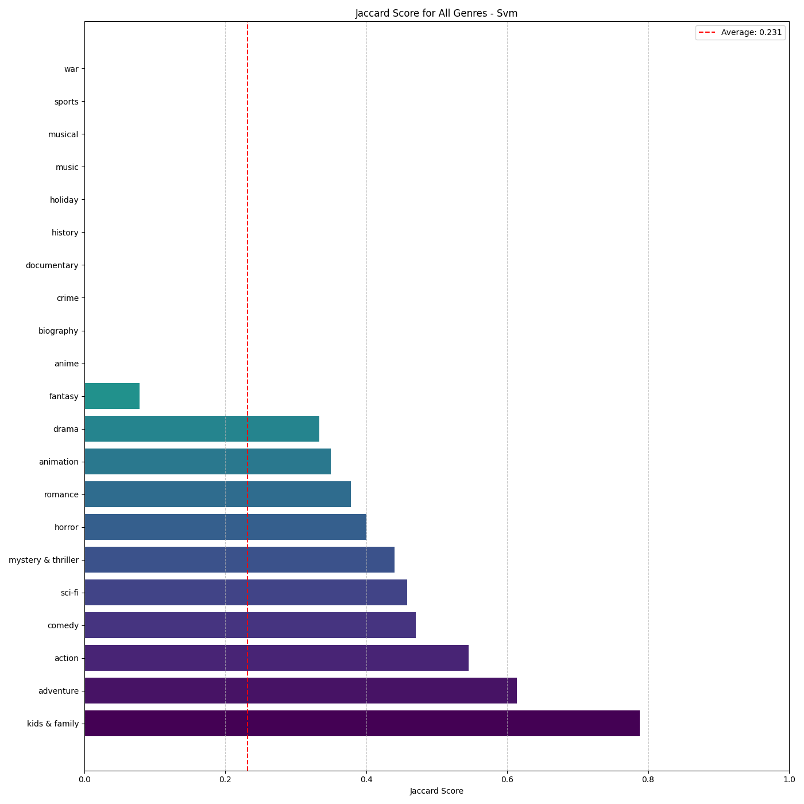
<p><em>Hiệu suất của mô hình SVM trên các thể loại phim (đã lọc bỏ thể loại không liên quan). SVM thể hiện hiệu suất xuất sắc với các thể loại có đặc điểm rõ ràng như documentary, horror và animation, nhưng vẫn gặp khó khăn với các thể loại chung chung như drama.</em></p>

10. Trực quan hóa kết quả có accuracy cao nhấL:

```python
def visualize_results(models, X_test, y_test, mlb):
    print("Visualizing results...")
    # Get best model based on partial accuracy
    best_model_name = max(models, key=lambda k: models[k].get('partial_accuracy', 0))

    # Calculate metrics if missing
    for model_name, model_info in models.items():
        if 'partial_accuracy' not in model_info:
            print(f"Calculating metrics for {model_name} on the fly...")

            # Predict with adjusted threshold
            y_pred, y_probs = predict_with_adjusted_threshold(model_info['model'], X_test, threshold=0.15)

            # Calculate metrics
            model_info['partial_accuracy'] = accuracy(y_test, y_pred)
            model_info['probabilities'] = y_probs

    # Plot metrics comparison
    plt.figure(figsize=(14, 8))

    # Metrics for each model
    jaccard_scores = [models[model]['jaccard'] for model in models]
    hamming_scores = [models[model]['hamming_loss'] for model in models]
    partial_acc_scores = [models[model]['partial_accuracy'] for model in models]

    x = np.arange(len(models))
    width = 0.25

    plt.bar(x - width, jaccard_scores, width, color='blue', label='Jaccard Score')
    plt.bar(x, hamming_scores, width, color='orange', label='Hamming Loss')
    plt.bar(x + width, partial_acc_scores, width, color='red', label='Partial Accuracy (≥1 correct in 3)')

    plt.title('Model Performance Comparison')
    plt.ylabel('Score')
    plt.xticks(x, models.keys())
    plt.axhline(y=0.85, color='r', linestyle='--', label='Target Score (85%)')
    plt.ylim(0, 1.0)

    # Add values on bars
    for i, v in enumerate(jaccard_scores):
        plt.text(i - width, v + 0.02, f'{v:.3f}', ha='center')

    for i, v in enumerate(hamming_scores):
        plt.text(i, v + 0.02, f'{v:.3f}', ha='center')

    for i, v in enumerate(partial_acc_scores):
        plt.text(i + width, v + 0.02, f'{v:.3f}', ha='center')

    plt.legend()
    plt.tight_layout()
    plt.show()
    plt.close()

    # Create a radar chart to compare model performance across multiple metrics
    plt.figure(figsize=(10, 8))

    # Define metrics to compare
    metrics = ['Jaccard Score', 'Hamming Loss', 'Partial Accuracy']

    # Number of metrics
    N = len(metrics)

    # Angle of each axis
    angles = [n / float(N) * 2 * np.pi for n in range(N)]
    angles += angles[:1]  # Close the loop

    # Radar chart plot
    ax = plt.subplot(111, polar=True)

    # For each model
    for i, model_name in enumerate(models.keys()):
        model = models[model_name]

        # Get metric values
        values = [
            model['jaccard'],
            model['hamming_loss'],
            model['partial_accuracy']
        ]
        values += values[:1]  # Close the loop

        # Plot model values
        ax.plot(angles, values, linewidth=2, label=model_name)
        ax.fill(angles, values, alpha=0.1)

    # Set labels
    plt.xticks(angles[:-1], metrics)

    # Y axis limits
    plt.ylim(0, 1)

    # Add legend
    plt.legend(loc='upper right', bbox_to_anchor=(0.1, 0.1))

    plt.title('Model Performance Radar Chart')
    plt.tight_layout()
    plt.show()
    plt.close()

visualize_results(models, X_test_reduced, y_test, mlb)
best_model = max(models, key=lambda k: models[k].get('partial_accuracy', 0))
print(f"\nBest model based on Accuracy: {best_model.upper()}")
print(f"Accuracy: {models[best_model]['partial_accuracy']:.4f}")
print(f"Jaccard score: {models[best_model]['jaccard']:.4f}")
print(f"Hamming loss: {models[best_model]['hamming_loss']:.4f}")
```
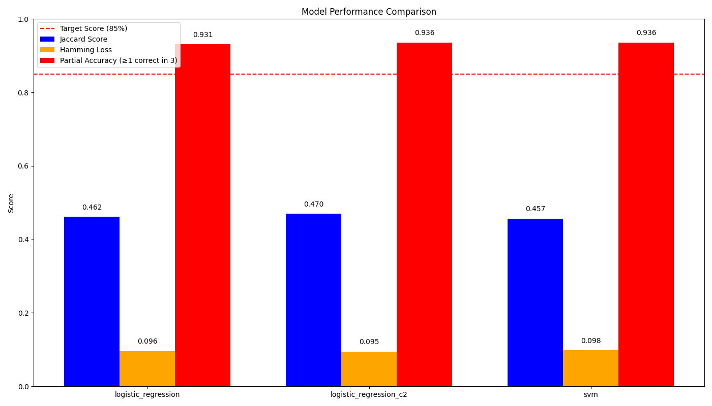
<p><em>So sánh hiệu suất của ba mô hình (Logistic Regression, Logistic Regression C=2.0, SVM) dựa trên Jaccard Score (độ tương đồng tập hợp), Hamming Loss (tỷ lệ nhãn sai), và Partial Accuracy (tỷ lệ đúng ít nhất một thể loại). SVM có hiệu suất tổng thể tốt nhất, nhưng Logistic Regression C=2.0 cũng rất cạnh tranh.</em></p>

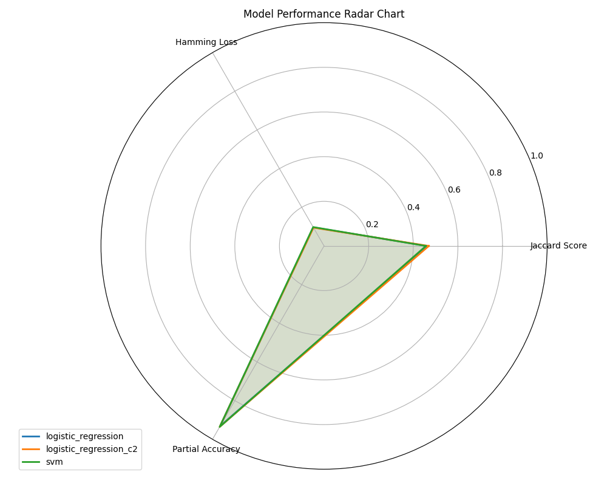
<p><em>Biểu đồ radar so sánh hiệu suất của cả ba mô hình trên ba thước đo khác nhau. Biểu đồ này cung cấp góc nhìn tổng quát về điểm mạnh và điểm yếu của từng mô hình. SVM cho hiệu suất tốt nhất ở hầu hết các thước đo.</em></p>

11. Tài liệu tham khảo:
- [MultiOutputClassifier Documentation](https://scikit-learn.org/stable/modules/generated/sklearn.multioutput.MultiOutputClassifier.html)
- [LogisticRegression Documentation](https://scikit-learn.org/stable/modules/generated/sklearn.linear_model.LogisticRegression.html)
- [TruncatedSVD Documentation](https://scikit-learn.org/stable/modules/generated/sklearn.decomposition.TruncatedSVD.html)
- [LSI-SVD Module](https://langvillea.people.charleston.edu/DISSECTION-LAB/Emmie'sLSI-SVDModule/p5module.html)
- [MinMaxScaler Documentation](https://scikit-learn.org/stable/modules/generated/sklearn.preprocessing.MinMaxScaler.html)
- [LabelEncoder Documentation](https://scikit-learn.org/stable/modules/generated/sklearn.preprocessing.LabelEncoder.html)
- [TfidfVectorizer Documentation](https://scikit-learn.org/stable/modules/generated/sklearn.feature_extraction.text.TfidfVectorizer.html)
- [Movie Genre Prediction](https://www.analyticsvidhya.com/blog/2019/04/predicting-movie-genres-nlp-multi-label-classification/)
- [TF-IDF Calculation](https://www.analyticsvidhya.com/blog/2021/11/how-sklearns-tfidfvectorizer-calculates-tf-idf-values/#:~:text=tf%20is%20the%20number%20of,calculate%20tf%20is%20given%20below)